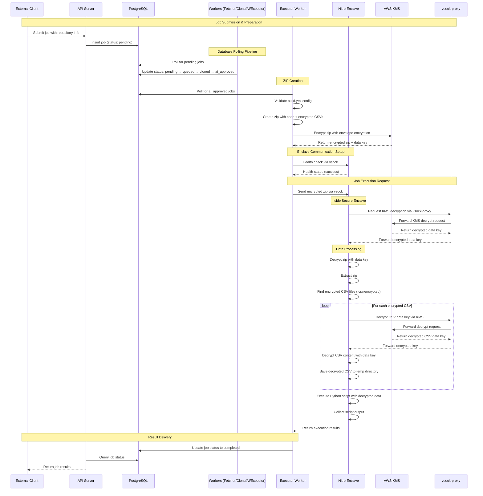
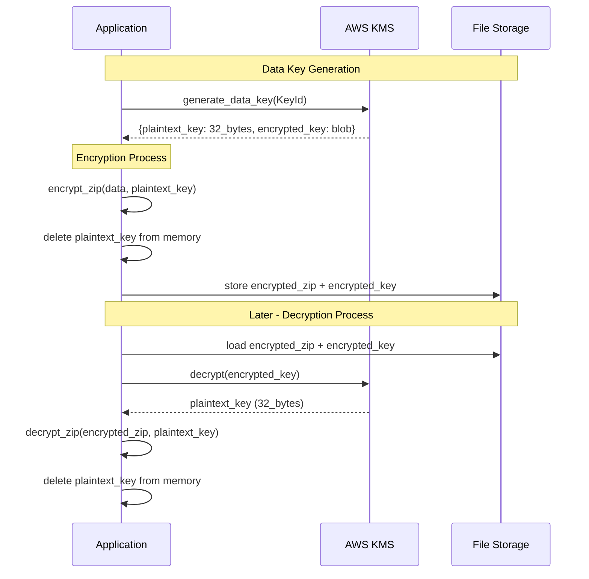
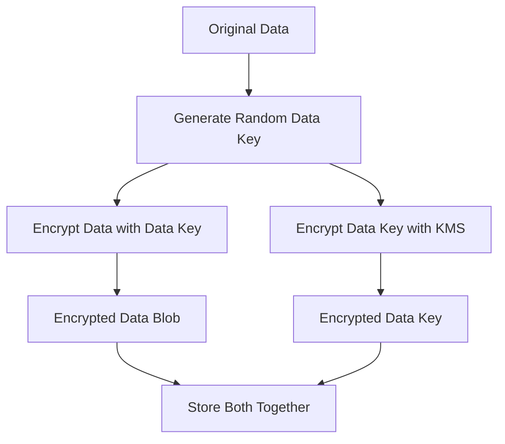
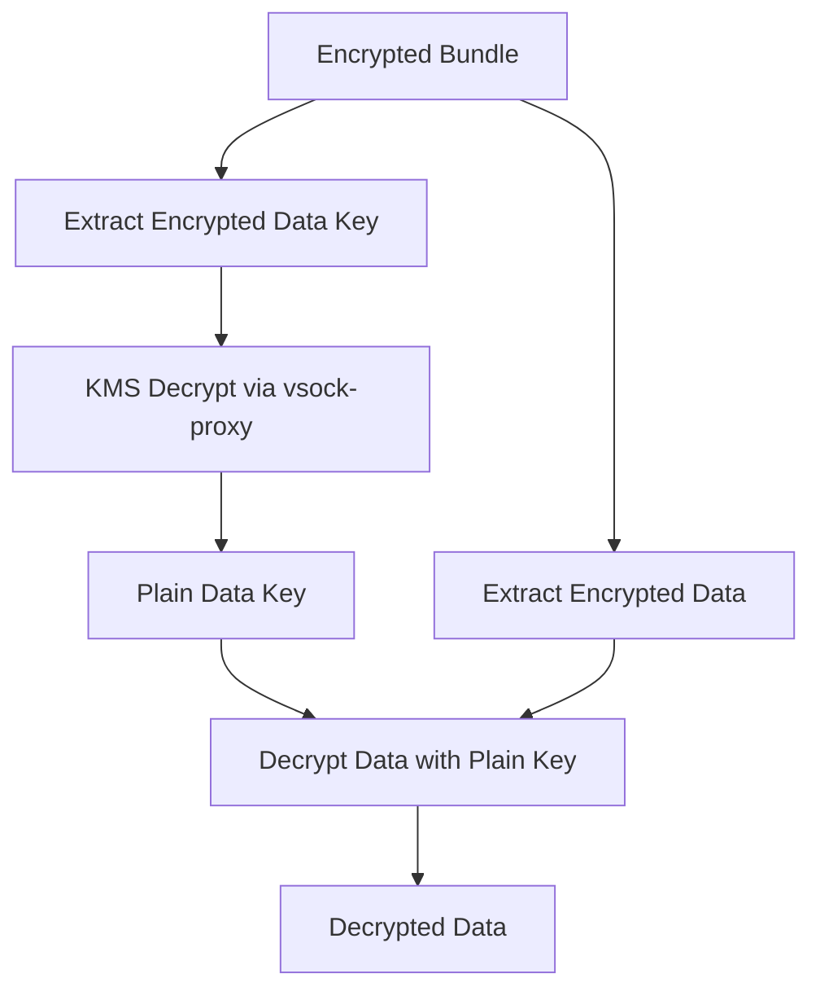
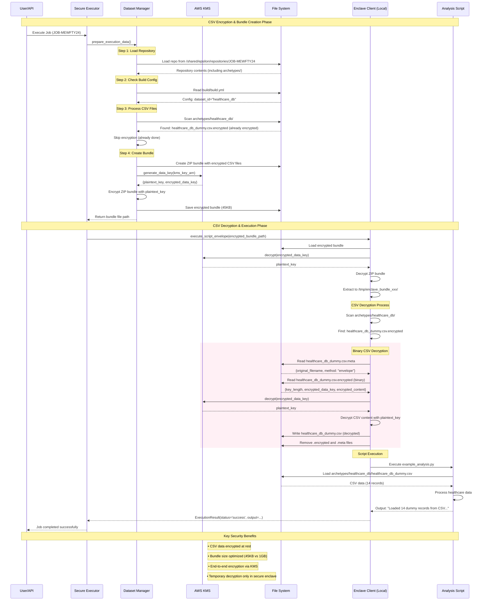

# Epsilon Coordinator - Nitro Enclave Job Execution

A secure, privacy-preserving analytics platform that enables confidential computing using AWS Nitro Enclaves and KMS-based encryption.

## Table of Contents

- [Overview](#overview)
- [Job Execution Flow](#job-execution-flow)
- [KMS Encryption Architecture](#kms-encryption-architecture)
- [Network Architecture](#network-architecture)
- [Security Model](#security-model)
- [Key Components](#key-components)
- [CSV Encryption System](#csv-encryption-system)
- [Deployment Requirements](#deployment-requirements)

## Overview

Epsilon Coordinator orchestrates secure job execution using AWS Nitro Enclaves with KMS-based encryption for data protection. Jobs flow from external clients through Docker containers into isolated Nitro Enclaves where sensitive data is decrypted and processed.

## Job Execution Flow



## KMS Encryption Architecture

### 1. Envelope Encryption Process

The system uses AWS KMS envelope encryption for secure data handling:

**KMS Data Key Generation & Usage:**


**Encryption (Outside Enclave):**


**Decryption (Inside Enclave):**


### 2. CSV File Encryption Format

Binary encrypted CSV files use this structure:
```
[4 bytes: key_length][encrypted_data_key][encrypted_csv_content]
```

With accompanying `.meta` file containing:
```json
{
  "original_filename": "data.csv",
  "encryption_method": "envelope",
  "created_at": "2025-09-09T06:42:20Z"
}
```

## Network Architecture

### VSOCK Communication
- **vsock-proxy** runs on the host system
- Forwards KMS requests from enclave to AWS KMS
- Command: `vsock-proxy 8000 kms.ap-southeast-2.amazonaws.com 443`

### Docker Network Configuration
```yaml
executor-worker:
  privileged: true
  network_mode: host
  volumes:
    - /dev/nitro_enclaves:/dev/nitro_enclaves
    - /var/run/nitro_enclaves/:/var/run/nitro_enclaves/
    - /usr/bin/nitro-cli:/usr/bin/nitro-cli
```

## Security Model

### Enclave Isolation
- **Nitro Enclave**: Cryptographically isolated VM
- **No Network Access**: Except via vsock to host
- **No Persistent Storage**: All data in memory
- **Attestation**: Cryptographic proof of enclave integrity

### Key Management
- **KMS Integration**: All decryption via AWS KMS
- **Temporary Keys**: Data keys only exist in enclave memory
- **No Key Storage**: Keys destroyed after processing

### Data Protection
- **Encrypted at Rest**: All sensitive data encrypted
- **Encrypted in Transit**: vsock communication
- **Memory Only**: Decrypted data never touches disk

## Key Components

### Outside Enclave
- **API Server**: Job submission endpoint
- **PostgreSQL**: Job state and status management
- **Workers**: Pipeline stages (job-fetcher, clone, ai-agent, executor)
- **Executor Worker**: Bundle preparation and orchestration
- **vsock-proxy**: KMS communication bridge

### Inside Enclave
- **Enclave Server**: vsock listener and request handler
- **KMS Decryptor**: Handles KMS decryption requests
- **CSV Decryptor**: Binary CSV file decryption
- **Bundle Executor**: Script execution with decrypted data
- **Script Executor**: Python script runner

## CSV Encryption System

### Overview

The CSV encryption system ensures sensitive data is protected throughout the entire pipeline while maintaining optimal performance and minimal storage overhead.

### Architecture Flow



### Key Features

#### 1. **Binary Encryption Format**
- **Problem Solved**: Previous Base64 JSON format caused 1GB+ bundle sizes
- **Solution**: Binary storage reduces bundles to ~45KB (2000% improvement)
- **Format**: 
  - `.csv.encrypted`: Binary encrypted data
  - `.csv.meta`: Small JSON metadata file

#### 2. **Envelope Encryption**
- **Data Keys**: Generated per CSV file via AWS KMS
- **Master Key**: Managed by AWS KMS (never exposed)
- **Process**: 
  1. Generate data key from KMS
  2. Encrypt CSV with data key
  3. Encrypt data key with master key
  4. Store encrypted data + encrypted data key

#### 3. **Dual Encryption Layers**
- **Layer 1**: Individual CSV files encrypted with KMS envelope encryption
- **Layer 2**: Entire ZIP bundle encrypted with KMS envelope encryption
- **Benefit**: Defense in depth while maintaining performance

### File Structure

```
archetypes/
└── healthcare_db/
    ├── __init__.py
    ├── healthcare_db.py              # Dataset loader
    ├── healthcare_db.json            # Schema definition
    ├── healthcare_db_dummy.csv.encrypted  # Binary encrypted CSV
    └── healthcare_db_dummy.csv.meta       # Encryption metadata
```

### Encryption Process

1. **Repository Loading**: Clone repository with archetype definitions
2. **CSV Detection**: Scan for `.csv` files in archetype directories
3. **KMS Key Generation**: Generate unique data key per CSV file
4. **Binary Encryption**: Encrypt CSV content, store as binary format
5. **Bundle Creation**: Create ZIP containing encrypted CSV files
6. **Bundle Encryption**: Encrypt entire ZIP with separate KMS key

### Decryption Process

1. **Bundle Decryption**: Decrypt ZIP bundle using KMS
2. **File Extraction**: Extract to temporary directory
3. **CSV Detection**: Find `.csv.encrypted` files
4. **Metadata Reading**: Load encryption metadata from `.csv.meta`
5. **Binary Decryption**: 
   - Read encrypted data key and content
   - Decrypt data key via KMS
   - Decrypt CSV content with data key
6. **File Restoration**: Create original `.csv` file
7. **Cleanup**: Remove encrypted files after successful decryption

## Deployment Requirements

### Host System
- AWS EC2 with Nitro Enclaves enabled
- Docker and docker-compose installed
- vsock-proxy running: `vsock-proxy 8000 kms.ap-southeast-2.amazonaws.com 443`

### AWS Permissions
- KMS decrypt permissions for enclave role
- Access to specified KMS keys for data decryption
- Regional KMS endpoint: `kms.ap-southeast-2.amazonaws.com`

### Environment Variables
```bash
DATABASE_URL=postgresql://...
OPENAI_API_KEY=sk-...
ENVIRONMENT=production
USE_LOCAL_ENCLAVE=false
```

### File Paths

#### Key Configuration Files
- `docker-compose.yml`: Container orchestration
- `workers/executor/enclave_app/`: Enclave application code
- `workers/executor/clients.py`: Enclave client interface
- `shared_storage/`: Temporary file storage

#### Execution Flow
1. **Job Queue**: PostgreSQL → Workers poll for jobs by status
2. **Bundle Prep**: `/shared/epsilon/repositories/JOB-ID/`
3. **Encrypted Storage**: `/shared/epsilon/enclave_execution_results/JOB-ID/`
4. **Enclave Temp**: `/tmp/enclave_bundle_*/` (inside enclave)

### Monitoring & Debugging

#### Log Locations
- **Executor Worker**: `docker logs coordinator-executor-worker-1`
- **Enclave Logs**: Inside enclave (shown in executor logs)
- **vsock-proxy**: Host system logs

#### Health Checks
- **Enclave Health**: `{"operation": "health_check"}` → `{"status": "success"}`
- **KMS Connectivity**: Verified during first decryption request
- **vsock Communication**: Tested with each job execution

This architecture ensures secure, isolated execution of sensitive data analysis jobs while maintaining compliance with data protection requirements.
