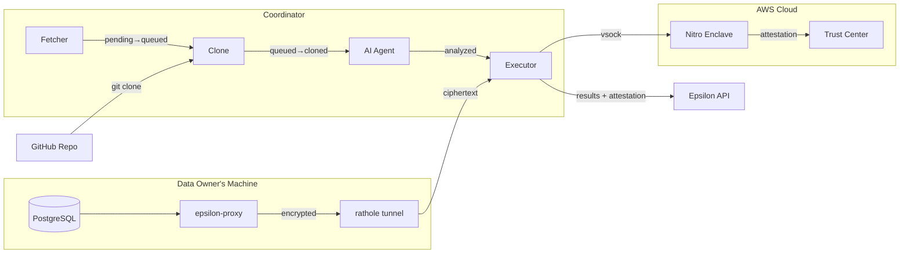
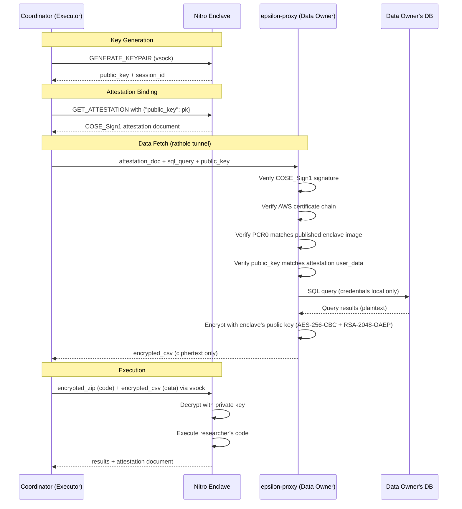
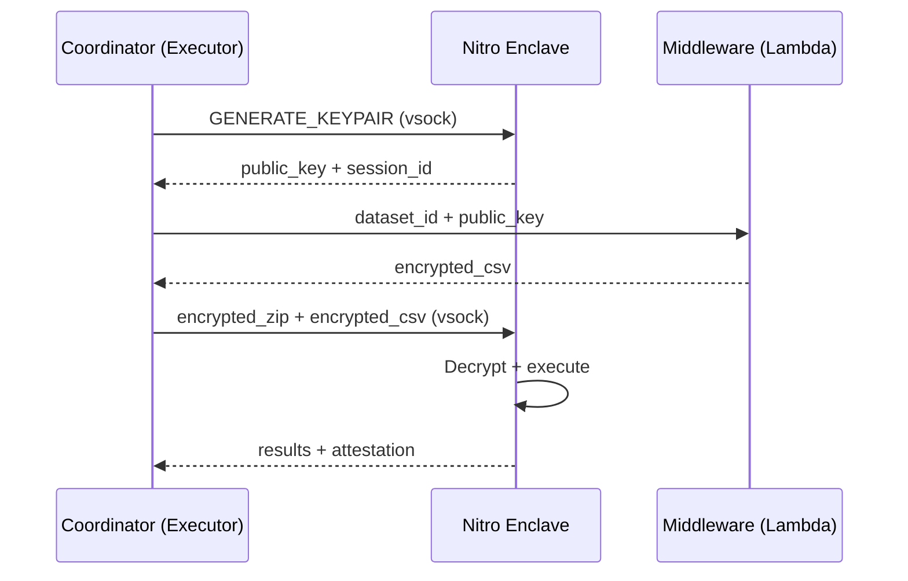
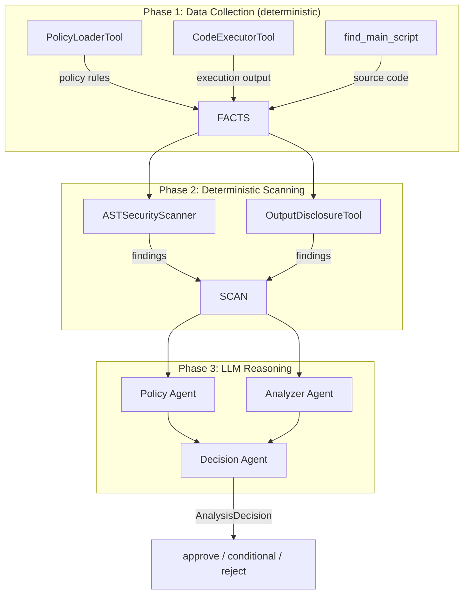
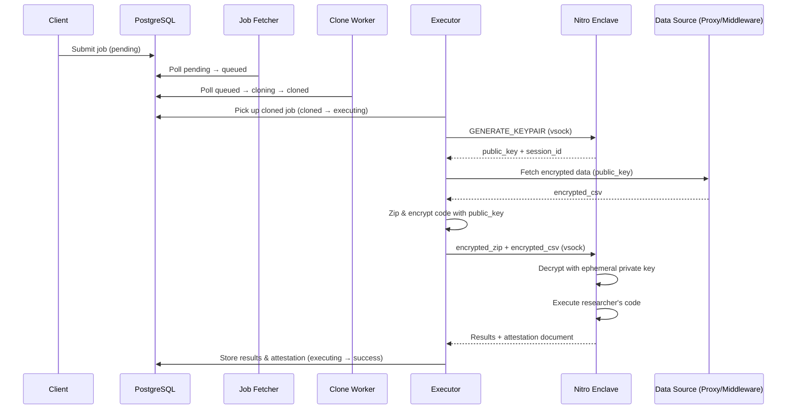

# Epsilon Coordinator

[](https://github.com/Epsilon-Data/epsilon-coordinator/actions/workflows/ci-cd.yml)
[](LICENSE)

A secure job orchestration system for privacy-preserving analytics using **AWS Nitro Enclaves**. Data is encrypted end-to-end and only decrypted inside a hardware-isolated enclave, ensuring zero trust throughout the pipeline.

## How It Works

```
Client submits job --> Workers prepare code & data --> Enclave executes privately --> Results returned
                                                  \--> AI analyzes in parallel (optional, does not gate execution)
```

1. **Job Fetcher** polls the database for pending jobs (`pending` → `queued`)
2. **Clone Worker** clones the user's repository (`queued` → `cloning` → `cloned`)
3. **Executor Worker** encrypts the code + data bundle and sends it to the enclave (`cloned` → `executing` → `success`/`failed`)
4. **AI Agent Worker** runs in parallel — analyzes code for policy compliance and writes metadata, but does **not** change job status or gate execution
5. **Nitro Enclave** decrypts, executes, and returns results with a cryptographic attestation

All sensitive data processing happens inside the enclave. The coordinator never sees decrypted data.

## Architecture

```
+------------------+     +------------------+     +------------------+
|   Job Fetcher    |---->|  Clone Worker    |---->| Executor Worker  |
| pending->queued  |     | queued->cloned   |     | cloned->success  |
+------------------+     +------------------+     +--------+---------+
                                |                          |
                                v                   vsock  |
                         +------------------+              v
                         |  AI Agent Worker |     +------------------+
                         |  (parallel,      |     |  Nitro Enclave   |
                         |   outside TCB)   |     |  (decrypt &      |
                         +------------------+     |   execute)       |
                                                  +------------------+
```

### Security Model

- **Nitro Enclave**: Hardware-isolated VM with no network, no disk, no operator access
- **Source-Side Encryption**: Data encrypted on the data owner's machine via [epsilon-proxy](https://github.com/Epsilon-Data/epsilon-proxy) — platform never sees plaintext
- **Hybrid Encryption**: Code and data encrypted with AES-256-CBC, key wrapped with the enclave's attested RSA-2048-OAEP public key; only the enclave holds the private key
- **Attestation**: Every execution produces a cryptographic proof of enclave integrity (PCR values)
- **AI Agent Outside TCB**: AI analysis is optional and runs outside the Trusted Computing Base — cannot affect attestation
- **Zero Trust**: Coordinator orchestrates but never accesses decrypted data

## Quick Start

### Prerequisites

- Docker and Docker Compose v2
- PostgreSQL database
- AWS account (for production with Nitro Enclaves)

### 1. Clone and configure

```bash
git clone https://github.com/Epsilon-Data/epsilon-coordinator.git
cd epsilon-coordinator
cp .env.example .env
# Edit .env with your DATABASE_URL and AWS credentials
```

### 2. Run database migrations

```bash
pip install -e .
alembic upgrade head
```

### 3. Start workers

```bash
# Using Docker Compose (recommended)
docker compose up -d

# Or run individual workers locally
WORKER_MODE=executor python entrypoint.py
```

### 4. Pull the pre-built image (optional)

```bash
docker pull ghcr.io/epsilon-data/coordinator:latest
```

## Configuration

All configuration is via environment variables. See [`.env.example`](.env.example) for the full list.

| Variable | Description | Default |
|----------|-------------|---------|
| `DATABASE_URL` | PostgreSQL connection string | *required* |
| `WORKER_MODE` | Worker type: `fetcher`, `clone`, `executor`, `ai` | `executor` |
| `USE_LOCAL_ENCLAVE` | Use local simulation instead of Nitro Enclave | `false` |
| `ENCLAVE_VSOCK_PORT` | vsock port for enclave communication | `5005` |
| `MIDDLEWARE_ENDPOINT_URL` | Lambda middleware URL for data fetch | *required for executor* |
| `AWS_REGION` | AWS region | `ap-southeast-2` |
| `POLLING_INTERVAL` | Job polling interval in seconds | `5` |
| `LOG_LEVEL` | Logging level | `INFO` |

## Project Structure

```
epsilon-coordinator/
  shared/                # Shared code across all workers
    db/                  # SQLAlchemy models, repository, migrations
    config.py            # Environment configuration
    base_worker.py       # Base worker polling loop
  workers/
    job_fetcher/         # Job fetcher (pending -> queued)
    clone/               # Repository cloner (queued -> cloned)
    executor/            # Enclave executor (cloned -> success/failed)
      executor.py        # Core execution flow (validate, encrypt, send)
      worker.py          # Database polling wrapper
      clients.py         # Enclave and middleware clients
      services.py        # Build validation, zip service
    ai_agent/            # AI policy analysis worker (see below)
  migrations/            # Alembic database migrations
  scripts/
    deploy-ec2.sh        # EC2 deployment automation
    collect_metrics.sql   # Performance metrics queries
  docker-compose.yml     # Production service definitions
  Dockerfile             # Single image for all workers
  entrypoint.py          # Worker mode router
```

## Detailed Architecture

### Overall Pipeline



### Key Generation

The enclave generates an **ephemeral RSA-2048 keypair** inside the TEE for each job:

1. Executor sends `GENERATE_KEYPAIR` to the enclave via vsock
2. Enclave generates the keypair inside the hardware-isolated VM
3. Enclave returns the **public key** + **session ID** to the executor
4. The **private key never leaves the enclave**
5. After job completion, the keypair is **destroyed** — it cannot be reused

Each job gets a unique keypair. There is no key reuse across jobs.

### Data Flow (Source-Side Encryption via Proxy)

The coordinator never sees plaintext data. When a data owner runs [epsilon-proxy](https://github.com/Epsilon-Data/epsilon-proxy):

1. **Executor** gets the enclave's public key (step above)
2. **Executor** requests an **attestation document** from the enclave with `{"public_key": pk}` in `user_data` — this cryptographically binds the public key to the enclave's identity
3. **Executor** sends the attestation + SQL query to the data owner's proxy via [rathole](https://github.com/rapiz1/rathole) tunnel
4. **Proxy verifies** the attestation: COSE_Sign1 signature, AWS certificate chain, PCR0, and public key binding
5. **Proxy** queries the local database (credentials stored only on the data owner's machine — never sent to the platform)
6. **Proxy** encrypts query results with the enclave's attested public key (AES-256-CBC + RSA-2048-OAEP key wrapping)
7. **Proxy** returns ciphertext through the rathole tunnel to the coordinator
8. **Coordinator** forwards ciphertext to the enclave via vsock (cannot decrypt)
9. **Enclave** decrypts with its ephemeral private key, executes the researcher's code, and generates an attestation



### Data Flow (Legacy Middleware)

For datasets hosted on the platform (not BYOD):

1. **Executor** sends dataset_id + enclave's public key to the middleware
2. **Middleware** encrypts the CSV with the enclave's public key
3. **Executor** forwards the encrypted CSV + encrypted code bundle to the enclave via vsock
4. **Enclave** decrypts and executes



### AI Policy Agent Pipeline

The AI agent is an **optional** worker that analyzes researcher-submitted code before execution. All agents operate **outside the Trusted Computing Base** — a compromised agent cannot affect attestation.



#### Phase 1: Data Collection
- **PolicyLoaderTool**: Loads dataset-specific policy rules (PII fields, blocked imports, blocked functions, threat tiers). Merges default policy with custom `build.yml` policy if present.
- **CodeExecutorTool**: Executes the researcher's code in a sandboxed environment to capture stdout/stderr and output files.
- **find_main_script**: Locates and reads the main analysis script.

#### Phase 2: Deterministic Scanning
- **ASTSecurityScanner**: Parses the Python AST to detect:
  - Blocked imports (`socket`, `subprocess`, `requests`, `pickle`, etc.)
  - Dangerous function calls (`eval`, `exec`, `compile`, `__import__`)
  - Dangerous attribute access (`os.system`, `os.popen`, etc.)
  - PII field access patterns (direct attribute or dictionary access to sensitive columns)
- **OutputDisclosureTool**: Checks execution output for:
  - Raw data leakage in stdout/stderr
  - Individual records in output files
  - Statistical disclosure risks

#### Phase 3: LLM Reasoning
The LLM agents receive **scanner findings, not raw code** — bounding the LLM's role to interpretation, not detection.

- **Policy Agent**: Evaluates whether the submission complies with dataset-specific policy rules.
- **Analyzer Agent**: Assesses code behavior based on AST findings, execution results, and output analysis.
- **Decision Agent**: Combines both assessments into a final `AnalysisDecision`:

```python
class AnalysisDecision(BaseModel):
    approved: bool                    # Final decision
    confidence_score: float           # 0.0 to 1.0
    reasoning: str                    # Explanation
    risks_identified: List[str]       # Identified risks
    recommendations: List[str]        # Suggested changes
    pii_details: List[CodeViolation]  # Specific code violations
    analyzed_files: List[str]         # Files analyzed
```

#### Security Constants

Imports are categorized as blocked or safe:

| Blocked (examples) | Safe (examples) |
|---|---|
| `socket`, `subprocess`, `requests` | `pandas`, `numpy`, `sklearn` |
| `pickle`, `ctypes`, `paramiko` | `json`, `csv`, `datetime` |
| `http`, `urllib`, `smtplib` | `matplotlib`, `seaborn`, `scipy` |

Full lists in `workers/ai_agent/security_constants.py`.

#### Review Tiers

| Tier | Data Type | Review |
|------|-----------|--------|
| 1 | Synthetic | Minimal checks |
| 2 | Aggregated | AI-only approval |
| 3 | Individual-level | AI analysis + mandatory human review |

#### Key Design Decisions

- **Agents see code, never data.** Code is already public (GitHub). Data credentials and plaintext never reach the agents.
- **Outside the TCB.** Every execution gets the same hardware-signed attestation regardless of agent recommendation.
- **Hybrid scanning.** Deterministic AST scanning catches known-bad patterns; LLM reasoning handles nuanced policy interpretation.
- **Current LLM:** gpt-4o-mini via API (proof of concept, configurable via `CREWAI_LLM_MODEL`). Production path: locally-hosted LLM (Qwen2.5-Coder-7B, DeepSeek-R1-Distill-32B). The AI layer can be disabled entirely.

## Development

```bash
# Install with dev dependencies
pip install -e ".[dev]"

# Set up commit message validation
pre-commit install --hook-type commit-msg

# Run tests
pytest

# Run database migrations
alembic upgrade head

# Generate a new migration after model changes
alembic revision --autogenerate -m "description"
```

This project uses [Conventional Commits](https://www.conventionalcommits.org/). See [CONTRIBUTING.md](CONTRIBUTING.md) for details.

## Deployment

### EC2 with Nitro Enclaves

1. Launch an EC2 instance with Nitro Enclaves enabled
2. Install Docker and the Nitro Enclaves CLI
3. Start the vsock proxy: `vsock-proxy 8000 kms.<region>.amazonaws.com 443`
4. Start the enclave: `nitro-cli run-enclave --eif-path epsilon-enclave.eif --cpu-count 2 --memory 512`
5. Deploy the coordinator: `docker compose up -d`

An automated setup script is also available: `./scripts/deploy-ec2.sh`

### Docker Image

The pre-built image is published to GitHub Container Registry:

```bash
docker pull ghcr.io/epsilon-data/coordinator:latest
```

The same image runs all worker types, controlled by `WORKER_MODE`.

## Job Execution Flow



## Related Projects

| Project | Description |
|---------|-------------|
| [epsilon-enclave](https://github.com/Epsilon-Data/epsilon-enclave) | Nitro Enclave application (runs inside the enclave) |
| [epsilon-trust-center](https://github.com/Epsilon-Data/epsilon-trust-center) | Public attestation verification UI |
| [nitro-verify](https://github.com/Epsilon-Data/nitro-verify) | Browser-based attestation verifier (npm package) |
| [sdk-epsilon](https://github.com/Epsilon-Data/sdk-epsilon) | Python SDK and CLI |

## License

[MIT License](LICENSE)
