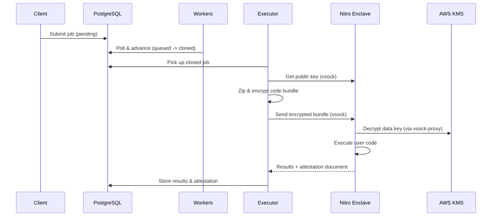

# Epsilon Coordinator

[](https://github.com/Epsilon-Data/epsilon-coordinator/actions/workflows/ci-cd.yml)
[](LICENSE)

A secure job orchestration system for privacy-preserving analytics using **AWS Nitro Enclaves**. Data is encrypted end-to-end and only decrypted inside a hardware-isolated enclave, ensuring zero trust throughout the pipeline.

## How It Works

```
Client submits job --> Workers prepare code & data --> Enclave executes privately --> Results returned
```

1. **Job Fetcher** polls the database for pending jobs
2. **Clone Worker** clones the user's repository
3. **Executor Worker** encrypts the code + data bundle and sends it to the enclave
4. **Nitro Enclave** decrypts, executes, and returns results with a cryptographic attestation

All sensitive data processing happens inside the enclave. The coordinator never sees decrypted data.

## Architecture

```
+------------------+     +------------------+     +------------------+
|   Job Fetcher    |---->|  Clone Worker    |---->| Executor Worker  |
|  pending->queued |     | queued->cloned   |     | cloned->success  |
+------------------+     +------------------+     +--------+---------+
                                                           |
                                                    vsock  |
                                                           v
                                                  +------------------+
                                                  |  Nitro Enclave   |
                                                  |  (decrypt &      |
                                                  |   execute)       |
                                                  +------------------+
```

### Security Model

- **Nitro Enclave**: Hardware-isolated VM with no network, no disk, no operator access
- **Envelope Encryption**: Data keys encrypted with AWS KMS; decryption only inside enclave
- **Attestation**: Every execution produces a cryptographic proof of enclave integrity (PCR values)
- **Zero Trust**: Coordinator orchestrates but never accesses decrypted data

## Quick Start

### Prerequisites

- Docker and Docker Compose v2
- PostgreSQL database
- AWS account (for production with Nitro Enclaves)

### 1. Clone and configure

```bash
git clone https://github.com/Epsilon-Data/epsilon-coordinator.git
cd epsilon-coordinator
cp .env.example .env
# Edit .env with your DATABASE_URL and AWS credentials
```

### 2. Run database migrations

```bash
pip install -e .
alembic upgrade head
```

### 3. Start workers

```bash
# Using Docker Compose (recommended)
docker compose up -d

# Or run individual workers locally
WORKER_MODE=executor python entrypoint.py
```

### 4. Pull the pre-built image (optional)

```bash
docker pull ghcr.io/epsilon-data/coordinator:latest
```

## Configuration

All configuration is via environment variables. See [`.env.example`](.env.example) for the full list.

| Variable | Description | Default |
|----------|-------------|---------|
| `DATABASE_URL` | PostgreSQL connection string | *required* |
| `WORKER_MODE` | Worker type: `fetcher`, `clone`, `executor`, `ai` | `executor` |
| `USE_LOCAL_ENCLAVE` | Use local simulation instead of Nitro Enclave | `false` |
| `ENCLAVE_VSOCK_PORT` | vsock port for enclave communication | `5005` |
| `MIDDLEWARE_ENDPOINT_URL` | Lambda middleware URL for data fetch | *required for executor* |
| `AWS_REGION` | AWS region | `ap-southeast-2` |
| `POLLING_INTERVAL` | Job polling interval in seconds | `5` |
| `LOG_LEVEL` | Logging level | `INFO` |

## Project Structure

```
epsilon-coordinator/
  shared/                # Shared code across all workers
    db/                  # SQLAlchemy models, repository, migrations
    config.py            # Environment configuration
    base_worker.py       # Base worker polling loop
  workers/
    job_fetcher/         # Job fetcher (pending -> queued)
    clone/               # Repository cloner (queued -> cloned)
    executor/            # Enclave executor (cloned -> success/failed)
      executor.py        # Core execution flow (validate, encrypt, send)
      worker.py          # Database polling wrapper
      clients.py         # Enclave and middleware clients
      services.py        # Build validation, zip service
    ai_agent/            # Optional AI validation worker
  migrations/            # Alembic database migrations
  scripts/
    deploy-ec2.sh        # EC2 deployment automation
    collect_metrics.sql   # Performance metrics queries
  docker-compose.yml     # Production service definitions
  Dockerfile             # Single image for all workers
  entrypoint.py          # Worker mode router
```

## Development

```bash
# Install with dev dependencies
pip install -e ".[dev]"

# Set up commit message validation
pre-commit install --hook-type commit-msg

# Run tests
pytest

# Run database migrations
alembic upgrade head

# Generate a new migration after model changes
alembic revision --autogenerate -m "description"
```

This project uses [Conventional Commits](https://www.conventionalcommits.org/). See [CONTRIBUTING.md](CONTRIBUTING.md) for details.

## Deployment

### EC2 with Nitro Enclaves

1. Launch an EC2 instance with Nitro Enclaves enabled
2. Install Docker and the Nitro Enclaves CLI
3. Start the vsock proxy: `vsock-proxy 8000 kms.<region>.amazonaws.com 443`
4. Start the enclave: `nitro-cli run-enclave --eif-path epsilon-enclave.eif --cpu-count 2 --memory 512`
5. Deploy the coordinator: `docker compose up -d`

An automated setup script is also available: `./scripts/deploy-ec2.sh`

### Docker Image

The pre-built image is published to GitHub Container Registry:

```bash
docker pull ghcr.io/epsilon-data/coordinator:latest
```

The same image runs all worker types, controlled by `WORKER_MODE`.

## Job Execution Flow



## Related Projects

| Project | Description |
|---------|-------------|
| [epsilon-enclave](https://github.com/Epsilon-Data/epsilon-enclave) | Nitro Enclave application (runs inside the enclave) |
| [epsilon-trust-center](https://github.com/Epsilon-Data/epsilon-trust-center) | Public attestation verification UI |
| [nitro-verify](https://github.com/Epsilon-Data/nitro-verify) | Browser-based attestation verifier (npm package) |
| [sdk-epsilon](https://github.com/Epsilon-Data/sdk-epsilon) | Python SDK and CLI |

## License

[Apache License 2.0](LICENSE)
