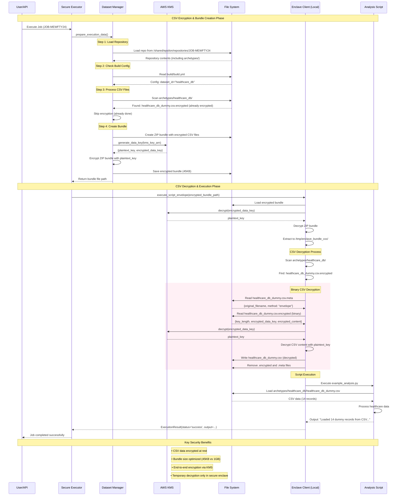

# Epsilon Coordinator

A secure, privacy-preserving analytics platform that enables confidential computing using AWS Nitro Enclaves and KMS-based encryption.

## Table of Contents

- [Overview](#overview)
- [Architecture](#architecture)
- [CSV Encryption System](#csv-encryption-system)
- [Components](#components)
- [Setup & Development](#setup--development)
- [Security Model](#security-model)

## Overview

Epsilon Coordinator is a distributed system that securely executes data analysis scripts on encrypted datasets within trusted execution environments (AWS Nitro Enclaves). The system ensures data privacy through end-to-end encryption and secure computation while providing a seamless development experience.

## Architecture

The system consists of several microservices orchestrated via Docker Compose:

- **Clone Worker**: Fetches and prepares source code repositories
- **Dataset Manager**: Handles CSV encryption and bundle preparation
- **Executor Worker**: Manages secure script execution in enclaves
- **AI Agent**: Provides intelligent analysis and decision-making
- **API Gateway**: Handles external requests and job orchestration

## CSV Encryption System

### Overview

The CSV encryption system ensures sensitive data is protected throughout the entire pipeline while maintaining optimal performance and minimal storage overhead.

### Architecture Flow



### Key Features

#### 1. **Binary Encryption Format**
- **Problem Solved**: Previous Base64 JSON format caused 1GB+ bundle sizes
- **Solution**: Binary storage reduces bundles to ~45KB (2000% improvement)
- **Format**: 
  - `.csv.encrypted`: Binary encrypted data
  - `.csv.meta`: Small JSON metadata file

#### 2. **Envelope Encryption**
- **Data Keys**: Generated per CSV file via AWS KMS
- **Master Key**: Managed by AWS KMS (never exposed)
- **Process**: 
  1. Generate data key from KMS
  2. Encrypt CSV with data key
  3. Encrypt data key with master key
  4. Store encrypted data + encrypted data key

#### 3. **Dual Encryption Layers**
- **Layer 1**: Individual CSV files encrypted with KMS envelope encryption
- **Layer 2**: Entire ZIP bundle encrypted with KMS envelope encryption
- **Benefit**: Defense in depth while maintaining performance

### File Structure

```
archetypes/
└── healthcare_db/
    ├── __init__.py
    ├── healthcare_db.py              # Dataset loader
    ├── healthcare_db.json            # Schema definition
    ├── healthcare_db_dummy.csv.encrypted  # Binary encrypted CSV
    └── healthcare_db_dummy.csv.meta       # Encryption metadata
```

### Encryption Process

1. **Repository Loading**: Clone repository with archetype definitions
2. **CSV Detection**: Scan for `.csv` files in archetype directories
3. **KMS Key Generation**: Generate unique data key per CSV file
4. **Binary Encryption**: Encrypt CSV content, store as binary format
5. **Bundle Creation**: Create ZIP containing encrypted CSV files
6. **Bundle Encryption**: Encrypt entire ZIP with separate KMS key

### Decryption Process

1. **Bundle Decryption**: Decrypt ZIP bundle using KMS
2. **File Extraction**: Extract to temporary directory
3. **CSV Detection**: Find `.csv.encrypted` files
4. **Metadata Reading**: Load encryption metadata from `.csv.meta`
5. **Binary Decryption**: 
   - Read encrypted data key and content
   - Decrypt data key via KMS
   - Decrypt CSV content with data key
6. **File Restoration**: Create original `.csv` file
7. **Cleanup**: Remove encrypted files after successful decryption
