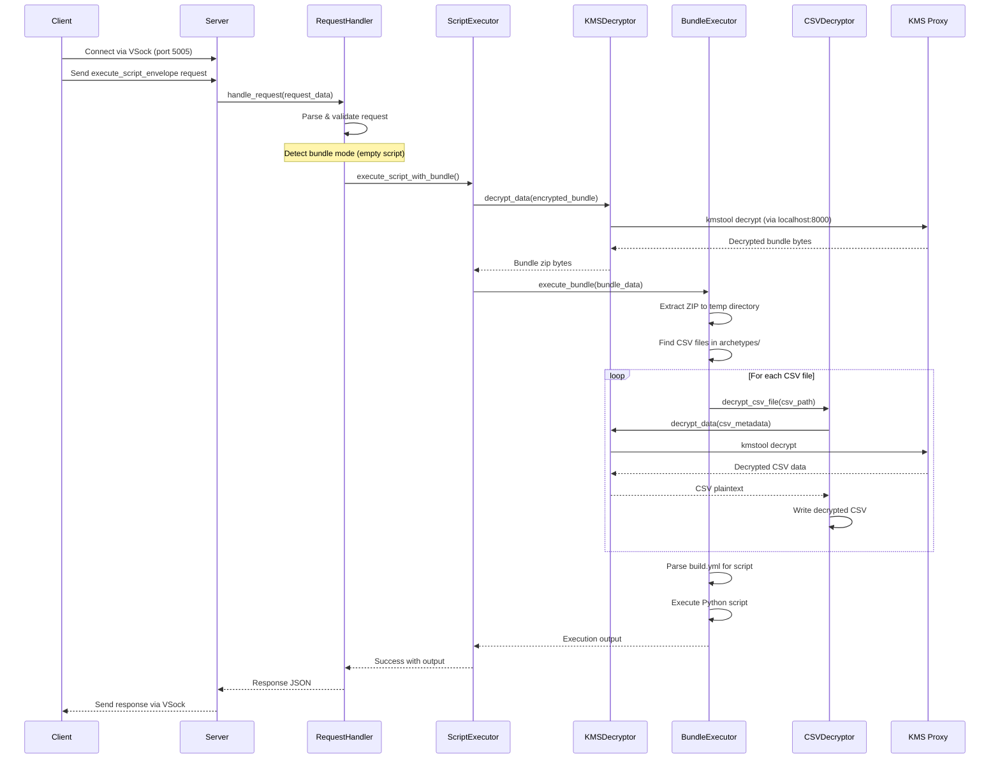
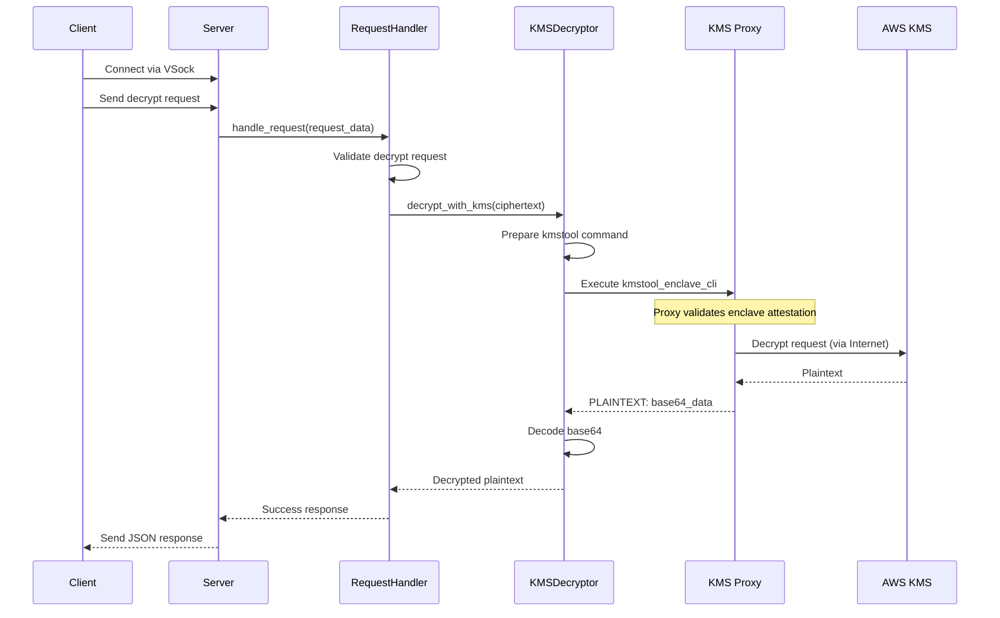
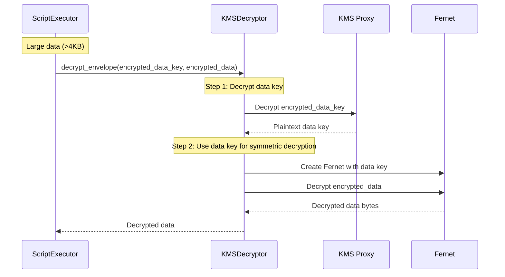
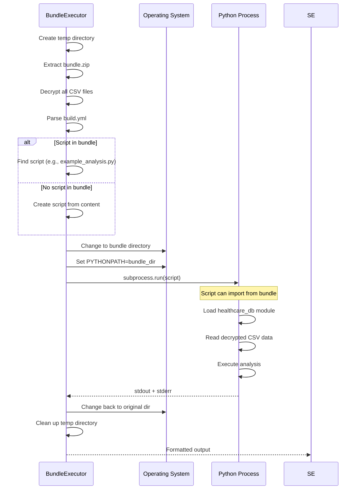
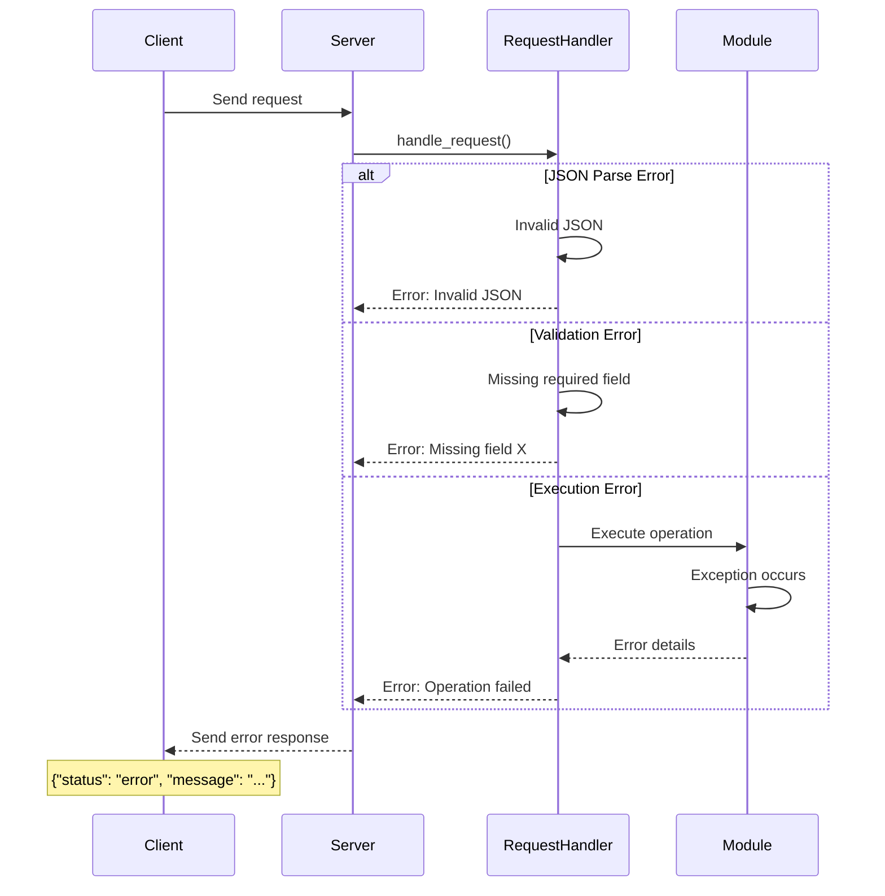
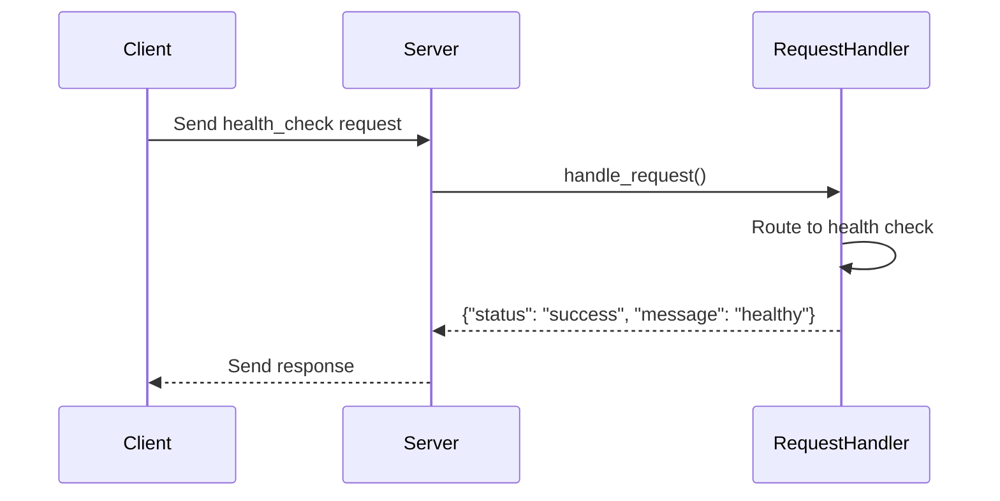

# Enclave Application Architecture

## Module Structure

```
enclave_app/
├── app.py              # Main entry point
├── config.py           # Configuration settings
├── server.py           # VSock server implementation
├── request_handler.py  # Request routing and handling
├── kms_decrypt.py      # KMS decryption operations
├── script_executor.py  # Script execution coordination
├── bundle_executor.py  # Bundle extraction and execution
└── csv_decryptor.py    # CSV file decryption
```

## Module Responsibilities

### 1. **app.py**
- Entry point for the enclave application
- Environment verification
- Server initialization

### 2. **config.py**
- Centralized configuration management
- Constants for ports, paths, timeouts
- Environment-based settings

### 3. **server.py**
- VSock server implementation
- Client connection handling
- Request/response management

### 4. **request_handler.py**
- Request parsing and validation
- Operation routing (decrypt, execute_script_envelope, health_check)
- Response formatting

### 5. **kms_decrypt.py**
- KMS decryption via kmstool-enclave-cli
- Direct decryption for small data (<4KB)
- Envelope decryption for large data (>4KB)
- Credential management

### 6. **script_executor.py**
- High-level script execution coordination
- Mode detection (bundle vs single script)
- Execution routing

### 7. **bundle_executor.py**
- ZIP bundle extraction
- Script discovery from build.yml
- Working directory management
- Subprocess execution

### 8. **csv_decryptor.py**
- CSV file encryption detection
- In-place decryption
- Error handling for corrupted files

## Data Flow

1. **Client Request** → Server receives encrypted request via VSock
2. **Request Handling** → RequestHandler validates and routes operation
3. **Decryption** → KMSDecryptor decrypts data using KMS proxy
4. **Execution** → ScriptExecutor determines execution mode
5. **Bundle Processing** → BundleExecutor extracts and runs scripts
6. **CSV Decryption** → CSVDecryptor handles encrypted data files
7. **Response** → Results sent back to client via VSock

## Security Features

- **No Network Access**: Enclave has no internet connectivity
- **KMS Proxy**: All KMS operations go through authenticated proxy
- **Memory Isolation**: Code runs in isolated enclave memory
- **Attestation**: Enclave identity verified by KMS
- **Credential Validation**: Each request includes AWS credentials

## Communication Protocols

### VSock Communication
- Port: 5005
- Protocol: TCP over VSock
- Format: JSON request/response

### KMS Proxy Communication
- Port: 8000 (localhost only)
- Tool: kmstool-enclave-cli
- Authentication: AWS credentials + attestation

## Error Handling

- Graceful degradation for CSV decryption failures
- Timeout protection for script execution
- Detailed error messages for debugging
- Cleanup of temporary files on all paths

## Sequence Diagrams

### 1. Bundle Execution Flow



### 2. Direct Decryption Flow



### 3. Envelope Decryption Flow



### 4. Script Execution Within Bundle



### 5. Error Handling Flow



### 6. Health Check Flow



## Component Interaction Summary

The sequence diagrams above illustrate:

1. **Bundle Execution**: The complete flow from encrypted bundle to executed script output
2. **Direct Decryption**: Simple KMS decryption for small data
3. **Envelope Decryption**: Two-step decryption for large data
4. **Script Execution**: How scripts run within the bundle context
5. **Error Handling**: Graceful error propagation
6. **Health Check**: Simple connectivity verification

Key points:
- All KMS operations go through the proxy (no direct internet access)
- Bundle execution involves multiple decryption steps
- Temporary files are always cleaned up
- Errors are caught and returned as structured responses